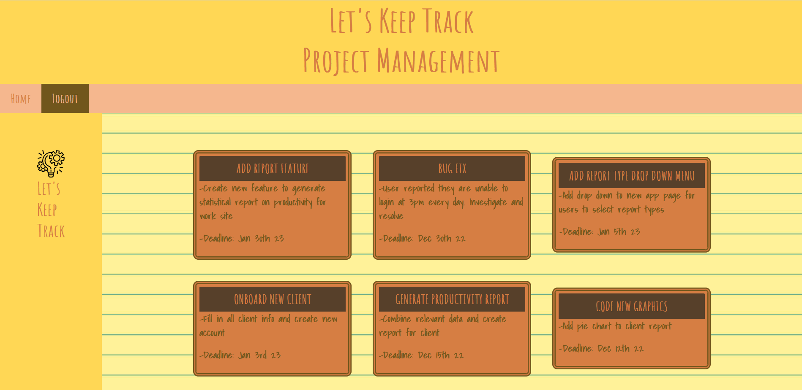
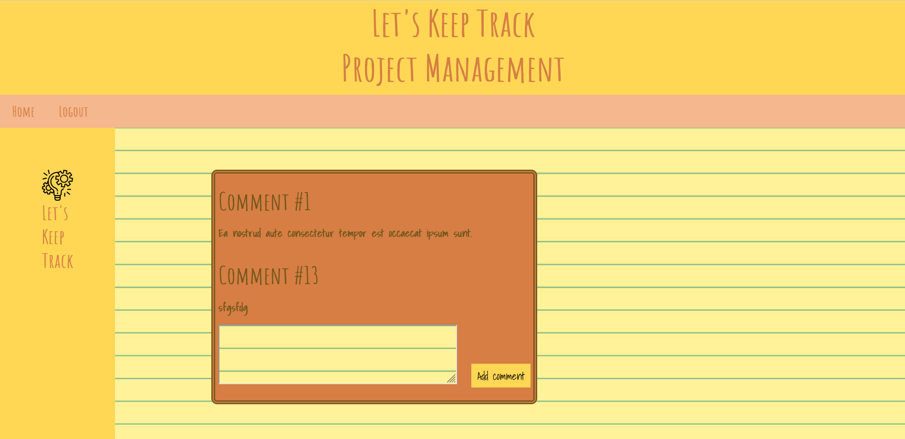

# Project Management App

## Description

Online project management application where individual tasks are viewed by the user who has selected them for completion. All users must log in to view the task dasboard. Users can comment on tasks to keep one another updated on their progress or provide feedback.

## Preview

## Usage

An interactive to-do list for employees or individuals sharing a project to manage different tasks which need to be completed and provide updates and feedback on each task.

## Installation

npm install
mysql -u root -p -> source db/schema.sql
npm run seed
npm start

## License

None

## Deployed Page Link

https://project-management-2022-but.herokuapp.com/
